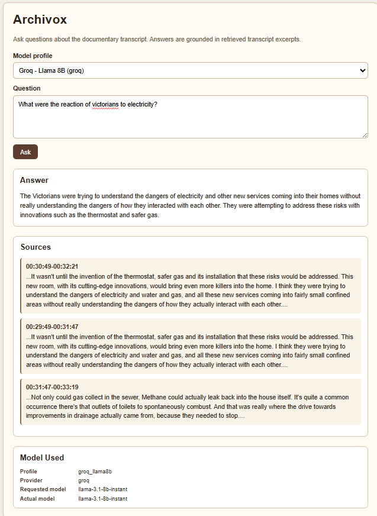
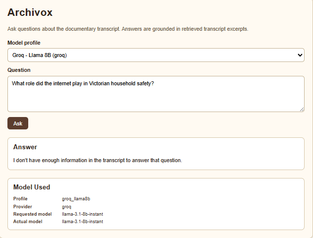
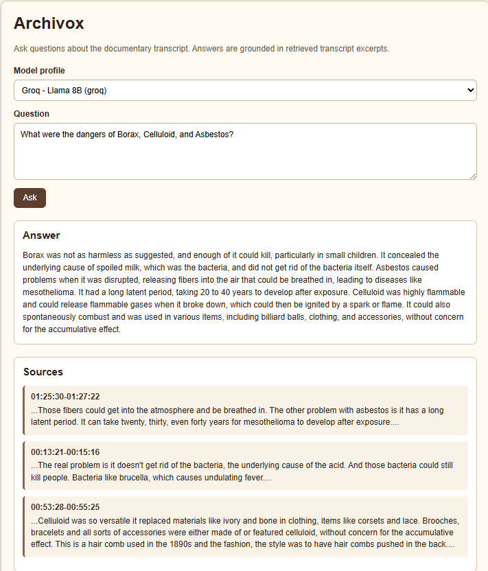
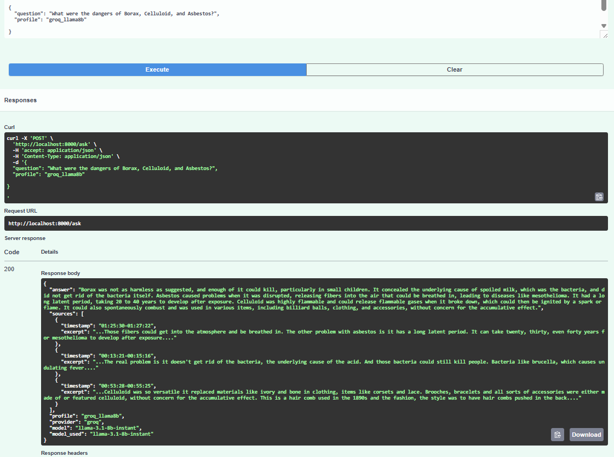

# Archivox

A documentary Q&A backend. Ask natural-language questions and receive answers grounded in timestamped transcript excerpts, with source citations pointing to the exact moments in the recording.

## How it works

At startup, Archivox parses a plain-text transcript, splits it into overlapping chunks, attaches configured metadata tags, embeds chunks with a local sentence-transformer model, and stores the index in ChromaDB. When a question arrives, the backend runs hybrid retrieval (metadata filtering + dense vector search + lexical fallback), re-ranks candidates with a cross-encoder, passes the top chunks to a configurable LLM, and returns a structured answer with timestamp-linked source references.

The index is automatically rebuilt if the transcript file, embedding model, chunking settings, or retrieval config change. Otherwise the persisted index is reused, so subsequent starts are fast.



## Stack

| Layer | Technology |
|---|---|
| API | FastAPI + Uvicorn |
| Embeddings | `all-MiniLM-L6-v2` (sentence-transformers, runs locally) |
| Re-ranker | `cross-encoder/ms-marco-MiniLM-L-6-v2` (runs locally) |
| Vector store | ChromaDB (local persistence) |
| LLM | Configurable - Groq, OpenRouter, Gemini, Ollama |
| Config | Pydantic Settings + `.env` + `config/models.yaml` + `config/retrieval.yaml` |

## Quickstart

### Local setup

```bash
pip install -r requirements.txt
cp .env.example .env
```

The embedding model (`all-MiniLM-L6-v2`) is downloaded automatically on first run and cached locally. Open `.env` and set your API key (see [Configure your LLM provider](#configure-your-llm-provider) below), place your transcript at `data/transcript.txt`, then:

```bash
uvicorn app.main:app --host 0.0.0.0 --port 8000
```

Open `http://localhost:8000` for the web UI, or `http://localhost:8000/docs` for the interactive API docs.

### Docker setup

No `pip install` on your host — the Dockerfile installs all dependencies inside the container at build time.

```bash
cp .env.example .env   # then add your API key
docker compose up --build
```

The first build downloads CPU-only PyTorch and both ML models (`all-MiniLM-L6-v2` and `cross-encoder/ms-marco-MiniLM-L-6-v2`) into the image layers — this takes a few minutes but is cached for all subsequent builds. On first startup the transcript is indexed into a named volume (`chroma_data`), which persists across container restarts so subsequent starts are fast.

**Using Ollama with Docker:** from inside the container, `localhost` points to the container itself, not your machine. Make sure `.env` has `OLLAMA_BASE_URL=http://host.docker.internal:11434/v1` — this is already the default in `.env.example`. With `ollama serve` running on the host, the container will reach it correctly and the UI will auto-discover your models.

Open `http://localhost:8000` for the web UI, or `http://localhost:8000/docs` for the interactive API docs.

### Configure your LLM provider

Open `.env` and set the API key for the provider you want to use. Groq is the default:

```env
LLM_PROFILE=groq_llama8b
GROQ_API_KEY=your_key_here
```

Groq offers two free models on the same API key, `groq_llama8b` and `groq_llama70b`, each with its own rate limit. OpenRouter also offers free-tier models, with a 20 requests-per-minute limit on the free tier:

```env
LLM_PROFILE=openrouter_free_router
OPENROUTER_API_KEY=your_key_here
```

Gemini Flash is available as an additional option, on a separate API key:

```env
LLM_PROFILE=gemini_flash
GEMINI_API_KEY=your_key_here
```

All three keys (`GROQ_API_KEY`, `OPENROUTER_API_KEY`, `GEMINI_API_KEY`) are listed in `.env.example`. Only the key matching your chosen `LLM_PROFILE` is required to run the service; the others are only needed if you switch to a profile using that provider.

**Getting API keys (all free tier):**

- **Groq** - create an account at [console.groq.com](https://console.groq.com), then go to *API Keys* and generate a key. Free tier includes `llama-3.1-8b-instant` (6,000 TPM) and `llama-3.3-70b-versatile` (12,000 TPM) with independent rate limits.
- **Google Gemini** - sign in at [aistudio.google.com](https://aistudio.google.com), click *Get API key*, and create a key in a new or existing project. Free tier covers Gemini 2.5 Flash with generous daily limits.
- **OpenRouter** - create an account at [openrouter.ai](https://openrouter.ai), go to *Keys*, and generate a key. Free-tier models (including `openrouter/free`) are available without adding credits.

**Fully local (no API key):** Install [Ollama](https://ollama.com), pull any model (e.g. `ollama pull llama3.2:3b`), and start `ollama serve`. The UI auto-discovers all locally available Ollama models and lists them in the profile dropdown. Set `OLLAMA_BASE_URL=http://localhost:11434/v1` in `.env` for local runs, or `http://host.docker.internal:11434/v1` when running inside Docker. No internet connection required after the model is downloaded.

**Switching providers** requires no code changes, in either of two ways:

- **Per request, via the web UI.** The "Model profile" dropdown lets you pick any configured profile and shows exactly which provider and model answered, in the "Model Used" panel below the answer.
- **As the default, via `.env`.** Anything calling `/ask` directly without specifying a `profile` (curl, `tests/test_ask.py`, or an evaluator's own test harness) uses whichever profile is set as `LLM_PROFILE`.

**Available profiles:**

1. `groq_llama8b` (default) / `groq_llama70b` - Groq.
2. `gemini_flash` - Google.
3. `openrouter_free_router` - auto-routes to whichever free model OpenRouter has available.
4. `ollama` - fully local, no API key required. Models are auto-discovered from your running Ollama instance and appear in the UI dropdown.

See [LLM profiles](#llm-profiles) below for the full list and how to obtain each provider's API key.

### Transcript format

Place your transcript at `data/transcript.txt`. The expected format is alternating timestamp and text lines:

```
00:00:00
Spoken text for the first segment goes here.
00:01:23
The next segment of spoken text continues here.
```

## Performance

All times are end-to-end HTTP round trips (retrieval + LLM generation) measured against a running server with cross-encoder re-ranking enabled. Clean-start run - index rebuilt from scratch before measurement.

### Response times by question type

| # | Question type | Time | Result |
|---|---|---|---|
| 1 | Factual | 3.40s | PASS |
| 2 | Synthesis | 4.23s | PASS |
| 3 | Named person / location | 2.88s | PASS |
| 4 | Vague | 3.61s | PASS |
| 5 | Out-of-scope | 3.18s | PASS |
| 6 | Multi-topic (Borax / Celluloid / Asbestos) | 3.50s | PASS |
| | **Average** | **3.47s** | **6/6** |

This table records the original six-question performance benchmark. The current
regression suite has 9 questions, including the later era-focused cases.

### Multi-topic retrieval coverage

| Query | Topics retrieved |
|---|---|
| "What were the dangers of Borax, Celluloid, and Asbestos?" | 3/3 |

### Provider comparison

| Provider | Model | Avg time | Notes |
|---|---|---|---|
| Groq (default) | `llama-3.1-8b-instant` | 3.47s | Hosted free tier |
| Ollama (local) | `llama3.2:3b` | ~9s | Fully offline, no API key |

Both are well within the 30-second requirement. Retrieval takes ~3s in both cases; the difference is generation speed — Groq's hosted inference is significantly faster than local CPU inference.

See [benchmarks.md](benchmarks.md) for full phase-by-phase results, CE on/off comparisons, and threshold calibration findings.

## Screenshots

**Factual question with grounded sources and model info**



**Out-of-scope refusal - no sources returned**



**Multi-topic query - all three topics retrieved**



**Interactive API docs (`/docs`)**



## API

### `POST /ask`

Ask a question about the transcript.

**Request**
```json
{
  "question": "What was borax used for in Victorian milk?",
  "profile": "groq_llama70b"
}
```

`profile` is optional. When omitted, the `LLM_PROFILE` from `.env` is used.

**Response**
```json
{
  "answer": "Between 00:10:33 and 00:13:21, borax was used to neutralize acid in sour milk, making spoiled milk taste fresh again. It did not remove the bacteria, so it could mask dangerous contamination.",
  "sources": [
    {
      "timestamp": "00:10:33-00:13:21",
      "excerpt": "Boracic acid was a component of a product called borax... used during the Victorian period to prolong the life of milk."
    },
    {
      "timestamp": "00:13:21-00:16:14",
      "excerpt": "The real problem is it doesn't get rid of the bacteria, the underlying cause of the acid."
    }
  ],
  "profile": "groq_llama8b",
  "provider": "groq",
  "model": "llama-3.1-8b-instant",
  "model_used": "llama-3.1-8b-instant"
}
```

Sources are returned in ranked order — most relevant first. Ranking uses cross-encoder relevance as the primary signal, with topic coverage considered for multi-topic questions so that the returned set covers all queried subjects rather than clustering around the highest-scoring one.

For out-of-scope questions, `sources` is empty and the answer says the transcript does not contain enough information.

### `GET /profiles`

Returns the list of available LLM profiles and the current default.

### `GET /health`

Returns `{"status": "ok"}`.

## LLM profiles

Profiles are defined in [config/models.yaml](config/models.yaml). The active profile is selected via `LLM_PROFILE` in `.env`, or per-request via the `profile` field in `/ask`.

| Profile ID | Provider | Model |
|---|---|---|
| `groq_llama8b` | Groq | Llama 3.1 8B (default) |
| `groq_llama70b` | Groq | Llama 3.3 70B |
| `gemini_flash` | Google | Gemini 2.5 Flash |
| `openrouter_free_router` | OpenRouter | Auto-routed free model |
| `ollama` | Ollama | Auto-discovered from running Ollama instance |

OpenRouter profiles with fallback models automatically retry on other free models if the primary is unavailable. This trades consistency for availability, the underlying model can vary between requests, so it is recommended as a last-resort profile rather than the default. Ollama profiles require no API key but require a local Ollama installation and are not used as the default given typical laptop hardware constraints.

To add a new profile, add an entry to `config/models.yaml`, no code changes needed.

Retrieval is model-agnostic: the same source chunks are returned regardless of which profile is active, since retrieval runs entirely before the LLM is called. Switching to a larger model (e.g. `groq_llama70b`) does not change what evidence is retrieved, but produces more detailed and precisely grounded answers from the same excerpts.

Retrieval tuning lives in [config/retrieval.yaml](config/retrieval.yaml). That file holds corpus-specific metadata rules, concept aliases, and broad/comparison query markers. For this transcript it defines historical `era` tags, but the code treats metadata fields generically so a different corpus can introduce fields like `speaker`, `topic`, or `chapter` without changing the chunker or retriever.

## Configuration reference

All settings can be set in `.env`. See [.env.example](.env.example) for the full list.

| Variable | Default | Description |
|---|---|---|
| `LLM_PROFILE` | `groq_llama8b` | Active LLM profile from `models.yaml` |
| `GROQ_API_KEY` | - | Groq API key |
| `OPENROUTER_API_KEY` | - | OpenRouter API key |
| `GEMINI_API_KEY` | - | Gemini API key |
| `OLLAMA_BASE_URL` | `http://localhost:11434/v1` | Ollama endpoint. Use `http://host.docker.internal:11434/v1` when running inside Docker |
| `TOP_K` | `5` | Chunks retrieved per query |
| `SOURCES_IN_RESPONSE` | `3` | Sources returned in the response |
| `SIMILARITY_THRESHOLD` | `0.48` | Max cosine distance for a chunk to be included |
| `RERANKING_ENABLED` | `true` | Enable cross-encoder re-ranking (`cross-encoder/ms-marco-MiniLM-L-6-v2`) |
| `EMBEDDING_MODEL` | `all-MiniLM-L6-v2` | Sentence-transformer model name |
| `CHUNK_WINDOW_SIZE` | `2` | Transcript segments per chunk |
| `CHUNK_OVERLAP` | `1` | Overlapping segments between consecutive chunks |
| `TRANSCRIPT_PATH` | `data/transcript.txt` | Path to transcript file |
| `CHROMA_PERSIST_DIR` | `chroma_db` | Directory for ChromaDB persistence |

Corpus-specific retrieval rules are configured in `config/retrieval.yaml`, not `.env`.

## Running the test suite

`tests/test_ask.py` is an end-to-end regression suite covering 9 questions: the core evaluation types (factual, synthesis, named-entity, vague, out-of-scope, and a hard multi-topic query) plus era-focused checks for Tudor, post-war, and cross-era retrieval. Each question has programmatic assertions; the script exits with code 1 if any assertion fails and prints a pass/fail summary.

```bash
# Terminal 1 - start the server
uvicorn app.main:app --port 8000

# Terminal 2 - run the test suite
python -m tests.test_ask
```

The script inserts a 15-second delay between questions to stay within Groq's free-tier token budget. A passing run takes a little over two minutes and prints `9/9 passed` with per-question response times.

For an additional citation check, start the server and run:

```bash
python -m tests.audit_sources
```

This verifies that returned source timestamps and excerpts trace back to `data/transcript.txt`. It is a grounding audit, not a semantic relevance judge.
